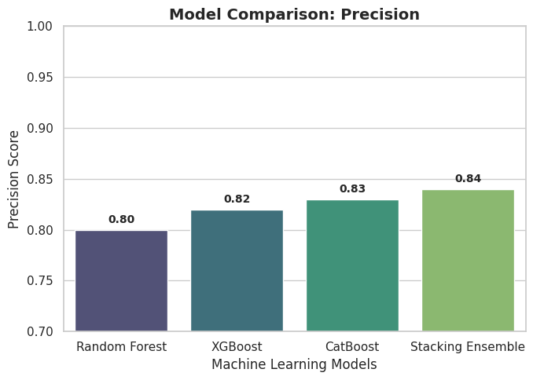
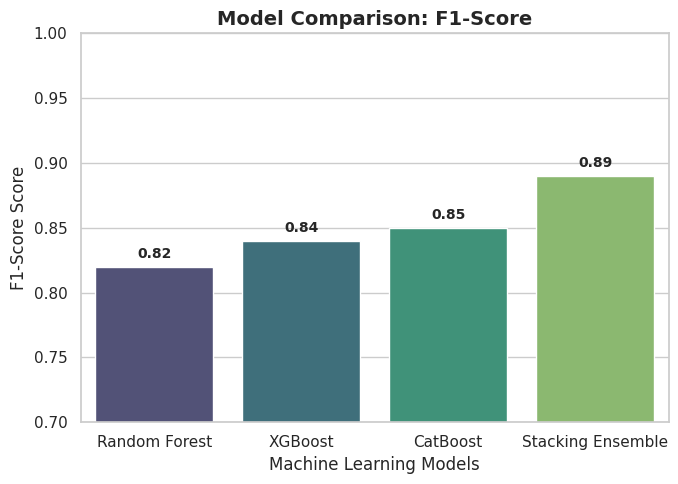

# 🩺 ECDSS-Heart: Explainable Clinical Decision Support System

## 📌 Executive Summary
**ECDSS-Heart** is a next-generation clinical framework designed to bridge the gap between "black-box" machine learning and medical trust. While traditional models often prioritize accuracy over interpretability, this system utilizes a **Heterogeneous Stacking Ensemble** integrated with **Explainable AI (XAI)** to provide transparent, high-sensitivity heart disease predictions.

---

## 🚀 Performance Metrics
This project was engineered with a **"safety-first"** clinical mindset. In medical screening, a false negative is significantly more dangerous than a false positive; hence, this model maximizes **Recall**.

| Metric | Result | Industry Context |
| :--- | :--- | :--- |
| **Recall (Sensitivity)** | **0.95** | Successfully identifies 95% of high-risk heart disease patients. |
| **Accuracy** | **88.95%** | High overall diagnostic reliability across 4 international cohorts. |
| **ROC AUC** | **0.95** | Superior diagnostic sensitivity and class separation capability. |

### **Full Performance Benchmarking**
The following chart illustrates how the Stacking Ensemble consistently outperforms individual base learners across all critical metrics:

---

## 🏗️ Architecture & Engineering Complexity
The system employs a sophisticated multi-tier pipeline to ensure data robustness and model generalization.

### 1. Stacking Ensemble Strategy
The core of the system is a two-tier architecture using a heterogeneous mix of **Random Forest**, **XGBoost**, and **CatBoost** feeding into a **Logistic Regression Meta-Learner**.

### 2. Diagnostic Reliability (ROC Curve)
The ROC analysis confirms the ensemble's superior capability in discriminating between healthy and high-risk states compared to standard models.

---

## 📊 Individual Parameter Deep-Dive
To satisfy clinical requirements, each parameter was analyzed separately to ensure the model does not sacrifice one metric for another.

| **Accuracy** | **Recall (Sensitivity)** |
| :---: | :---: |
|  |  |
| **Precision** | **F1-Score** |
|  |  |

---

## 🔍 Explainability Layer (XAI)
In the 2026 healthcare landscape, interpretability is a regulatory requirement. ECDSS-Heart moves from purely predictive to **prescriptive**.

* **Global Interpretability (SHAP)**: Provides a transparent view of which clinical features are driving global decisions.
* **Actionable Insights (DiCE)**: Implements **Diverse Counterfactual Explanations** to tell clinicians exactly what minimal physiological changes would shift a patient from "High Risk" to "Safe".

---

## 🛠️ Technical Stack
* **Languages**: Python 3.9+
* **ML Frameworks**: Scikit-Learn, XGBoost, CatBoost
* **XAI Frameworks**: SHAP, DiCE (Diverse Counterfactual Explanations)
* **Data Processing**: Pandas, NumPy, SMOTE-Tomek
